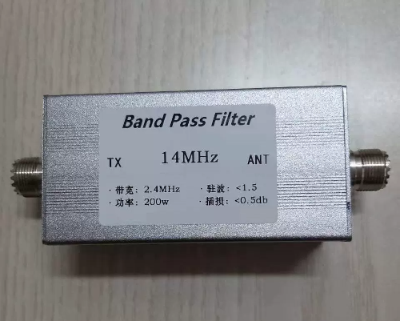
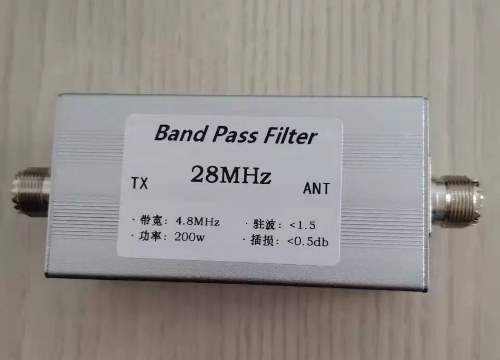
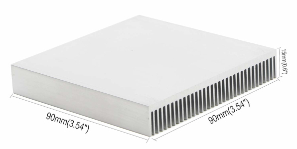
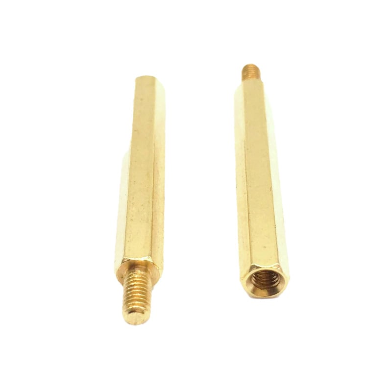
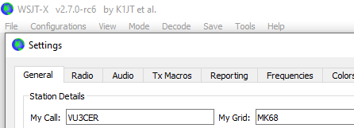
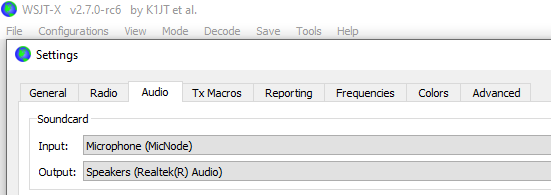
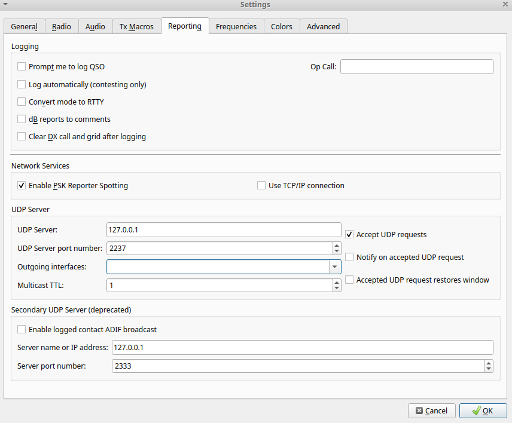
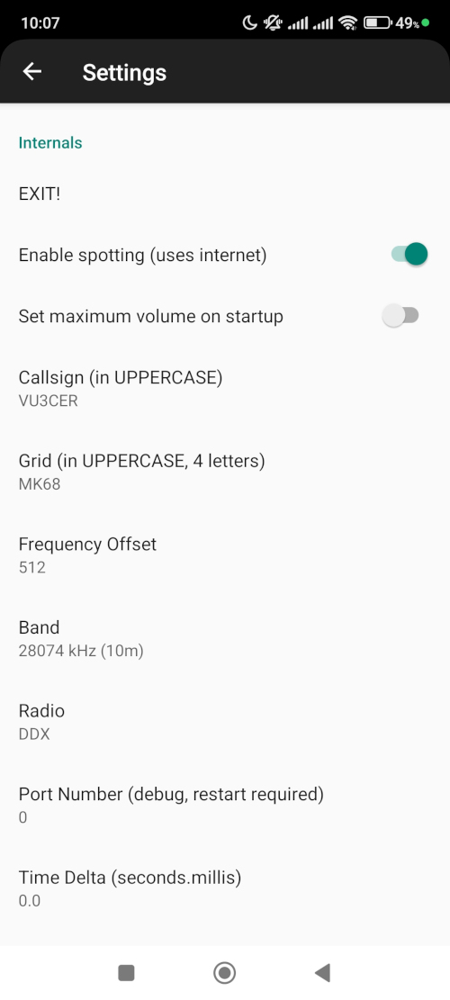
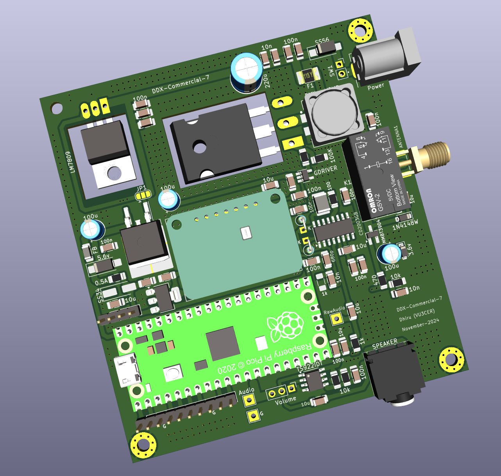

# Overview

DDX is a rugged 5W+ digital transceiver featuring manual band switching and
flexible power capabilities. Designed for reliability and ease of use, it's
perfect for digital modes like FT8.

DDX is brought to you by `Yantra Research`!

# Supported Modes

- FT8

# Other Modes

- WSPR (a dedicated firmware is in the works)

- FT4 (support can be added as per demand)

# Power Specifications

- ~5W output @ 15v on 28 MHz (after strong BPF)

- ~7W output @ 20v on 28 MHz (after strong BPF)

# Requirements

The following items are required for operating DDX:

- Power Source (Choose one)

  - USB PD 3.0 battery bank (portable and flight-safe option) - RECOMMENDED!

  - Traditional "12V" battery (4S LFP or 3S Li-ion or lead-acid)

  20v input (typically via PD 3.0) is RECOMMENDED!

- An antenna

  For field operations, we recommend getting / building an EFHW antenna.

  See https://github.com/kholia/HF-Balcony-Antenna-System for an example.

  https://www.kk5jy.net/three-wire-gp/ is a solid choice as well.

  The `Banggood` store also sells an EFHW 49:1 transformer for a reasonable
  price.

- Laptop / PC / Android phone

  The laptop can run the standard WSJT-X software.

  On Android, use our `FT8 Radio` app from Google Play Store.

- TX-BPF (*HIGHLY RECOMMENDED* for good performance and compliance, *REQUIRED* if you have radio interference problems)

  Update (December-2024): [We have open-sourced our TX-BPF designs here](https://github.com/kholia/DDX/tree/master/RX-TX-BPF-2025-v2).

  Tip: Buy one filter for your favorite band and then keep adding more later on

  Sources: eBay / AliExpress

  Cost: ~45 USD

  This TX-BPF helps your other radios as well and is a one-time investment.

  

  

  While many amateur radio operators focus *solely* on antenna optimization,
  the significant benefits of TX-BPF filters are often overlooked or
  under-discussed in the hobby!

  Even with HOA antenna restrictions, you can still optimize your station's
  performance through proper TX-BPF filtering.

- [Optional] Common-mode choke (CMC)

  Can be useful depending on your operating conditions.

- [Optional] PD Trigger Module

  Something like [this module](https://punoscho.in/product/usb-qc-pd-afc-trigger-decoy-board-module-15v/).

- [Optional] 10 meters plus of coax cable if operating an EFHW antenna.

# Supplied components

- 2 x mica insulator pads (for IRF510 and 7809 regulator)

- 2 x TO-220 bushes (for IRF510 and 7809 regulator)

- 2 x steel screws + spring washers + regular washers + nuts

- 1 x 5.5x2.1mm DC power cable (male connector)

- [Optional] Small TO-220 + TO-3 heat sinks

- [Optional] M3 standoffs

# Assembly Steps

- Connect the fully assembled DDX board to a heat sink (heat sink can supplied
  as an option).

  

  This above heat sink needs two holes to be made in it. A 3mm bit on a battery
  powered hand drill is sufficient for the job.

  [ALTERNATE HEAT SINKING OPTION]

  You can also use two smaller heat sinks like the following:

  - https://etstore.in/index.php/product/8087/ (Small TO-220 heatsink)

  - https://www.electronicscomp.com/heat-sink-to3-40mm (Yes - a TO-3 heatsink)

  The whole assembled PCB can then be raised on M3 standoffs.

  

  https://robu.in/product/m3-x-35mm-male-to-female-brass-hex-threaded-pillar-standoff-spacer-12-pcs/

- Put the DDX board into a suitable enclosure of your choice. This is optional
  for home usage.

- Done!

# Power-on sequence

- First, connect the Micro-USB cable from DDX to the PC or phone

- Next, turn on the DC power supply (using the onboard switch)

# Usage (with WSJT-X)

* Configure WSJT-X with your callsign and grid.

  

* Select `MicNode` as the Soundcard Input.

  

  Tip: The `Soundcard Output` setting does NOT matter.

* Ensure the following default settings are present.

  

* Launch the [wsjtx_helper/transceiver_server.exe](https://github.com/kholia/DDX/raw/refs/heads/master/wsjtx_helper/transceiver_server.exe) program.

* That's it!

# Usage (with `FT8 Radio` app on Android)

* Install `FT8 Radio` app from Google Play Store.

* Launch the app and go to settings (`gear icon`).

  Configure settings and choose `DDX` as the radio.

  NB: Restart the app forcefully.

  

* Connect DDX to the phone using a Micro-USB cable and a reliable OTG adapter.

* Done!

PS: See https://github.com/kholia/DigitalRadioReceiverSupport/tree/master/NewApp for more help.

# Tips

For best results, we recommend syncing time on your laptop / PC using
https://www.timesynctool.com/ software.

On Android, open the https://time.is/ site to see the clock delta.

# Features

- It comes as a fully tested-on-air board with minimal assembly required.

- Single USB connection for Audio + CAT control

  DDX has a built-in 'sound card'

- Rock-solid PA which handles open, short, and bad SWR conditions (~10:1 SWR
  tested)

- Rock-steady VFO which does NOT drift even under exposed conditions. Yes - it
  receives WSPR at 28 MHz just fine.

- Reliable T/R switching based on a DPDT relay

- No toroids to wind with the external TX-BPF in use ;-)

- The final MOSFET remains as cool as a cucumber (Class-D operation)

- DDX has a bit-perfect, deterministic TX output

  We simply do NOT use the audio tones emitted by the PC (or phone).

  We implement the various FSK encoders on the MCU itself.

- It works beautifully with the 'FT8 Radio' app
  (https://github.com/kholia/DigitalRadioReceiverSupport/). The 'FT8 Radio' app
  handles FT8 decoding well in real time (Native MCU decoders offer significantly
  reduced performance at the moment). The app can decode 35++ stations at a time,
  and even large screens can fill up very rapidly - such is the receiver's
  performance (with a BPF)!

  Note: The FT8CN app is NOT supported.

- No calibration is usually required. Just pick up DDX and it is ready to go on
  air. It comes with 26 MHz 0.5ppm TCXO as a standard.

- Low cost (cost-effective)

- Stress tested by WSJT-Z and WSJT-X for multiple days

- DDX routinely receives FT8 traffic from 80 to 100+ countries using a simple
  5m long EFHW antenna with a BPF attached.

  And we use a SMPS with RuiDeng DC-DC buck module with >= 100mV ripple in our
  testing work to "stress out" the receiver.

- All this in a compact (< 100mmx100mm) size!

# Limitations

- Special / complex callsigns are NOT supported yet.

- While we have a fully-functional VFO, it is locked to certain FT8 frequencies
  for safety reasons. You can request addition of more frequencies as needed.

# Firmware Upgrade

Note: DDX comes with the firmware installed on it.

- Disconnect all power sources

- Unplug the Pico MCU board from the computer

- Keep the white button on the Pico MCU board pressed, and connect Pico to the
  computer via a USB cable

- Upload the supplied `.uf2` firmware file to the new drive that opens up on
  your computer

- Done!

# Render

# Support Resources

- [The Global Communications Transceiver](https://www.youtube.com/watch?v=b82O-rVQVpk) - Video demo of older version

- [FT8 Radio App demo](https://www.youtube.com/watch?v=OX8Knu0yh6M)

- [DDX contest writeup](https://www.electronicwings.com/users/DhiruKholia/projects/4382/global-communications-transceiver)

- https://github.com/kholia/wsjtx

# Pricing

- Option 1: Kit with all components (including Pico 2 and TCXO Si5351 module) and blank PCB: 2499 INR (shipping within India included).

- Option 2: 80% assembled boards with remaining components (including Pico 2 and TCXO Si5351 module): 3999 INR (shipping within India included).
