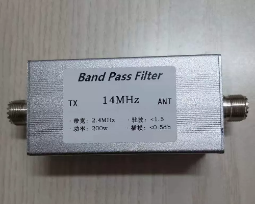
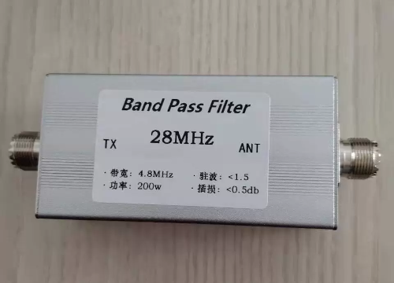
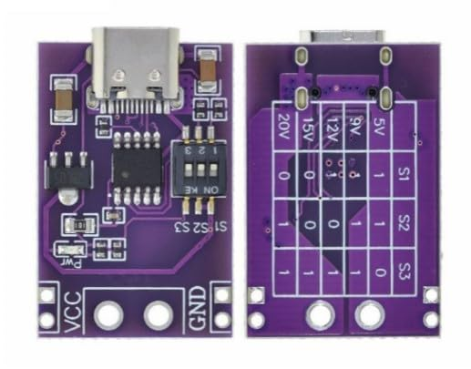
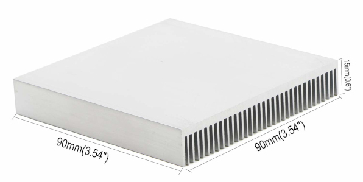
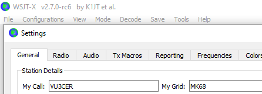
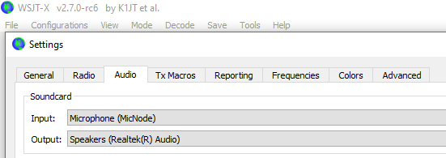
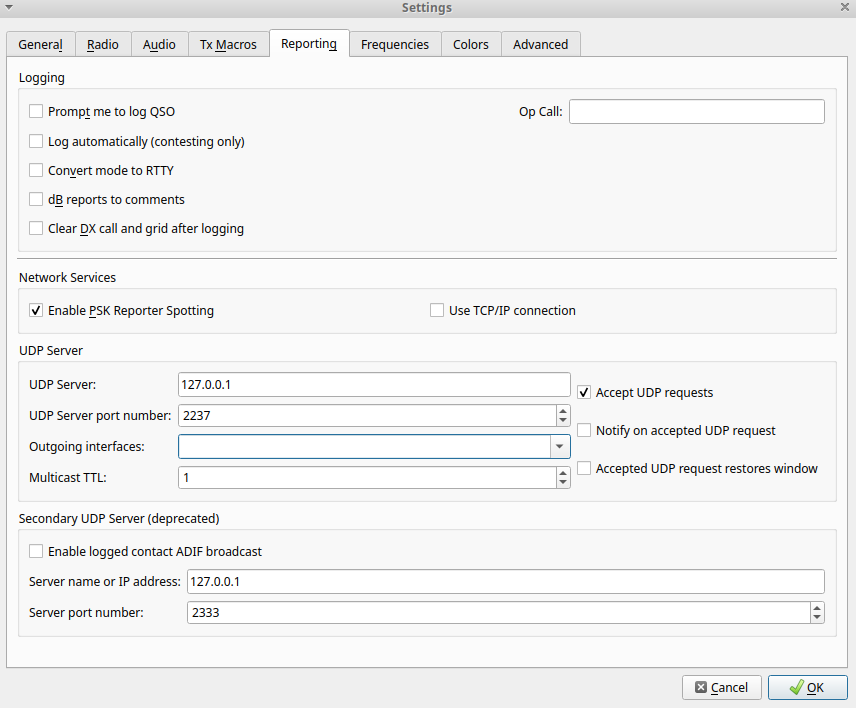
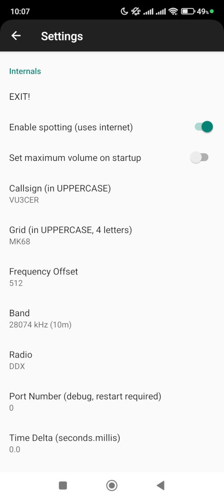
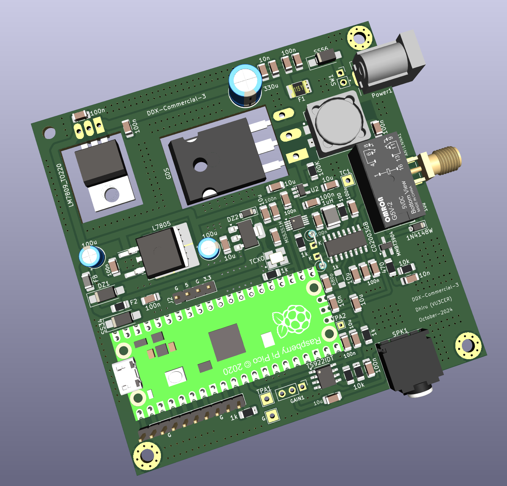

# Overview

DDX is a rugged 10W digital transceiver featuring manual band switching and
flexible power capabilities. Designed for reliability and ease of use, it's
perfect for digital modes like FT8.

# Power Specifications

- 5W+ output at 12v

- 10W+ ouput at 20v (using PD 3.0 USB battery bank)

- 25W+ output at higher voltages (external fan REQUIRED!)

  FT8 and WSPR modes have killed many Icom and other rigs before ;)

# Requirements

The following items are required for operating DDX:

- Power Source (Choose one)

  - Traditional "12V" battery (LFP or Li-ion or lead-acid)

  - PD 3.0 USB battery bank (recommended for portability)

    Example: Amazon Basics Ultimate Power 20000mAh (PD100W)

    Advantage: TSA-compliant for air travel

  With a PD 3.0 compatible USB battery bank, we can do 10W+ easily in a
  portable fashion.

- An antenna

  For field operations, we recommend getting / building an EFHW antenna.

  See https://github.com/kholia/HF-Balcony-Antenna-System for an example.

  https://www.kk5jy.net/three-wire-gp/ is a solid choice as well.

- Android phone or laptop

  The laptop can run the standard WSJT-X software.

  On Android, use our `FT8 Radio` app from Google Play Store.

- TX-BPF (*HIGHLY RECOMMENDED* for good performance and compliance, *REQUIRED* if you have radio interference problems)

  Sources: eBay / AliExpress

  Cost: ~45 USD

  This TX-BPF helps your other radios as well and is a one-time investment.

  

  

  If you have the budget, better TX-BPF filters are available from SurgeStop
  (Morgan Systems).

  While many amateur radio operators focus *solely* on antenna optimization,
  the significant benefits of TX-BPF filters are often overlooked or
  under-discussed in the hobby!

  Even with HOA antenna restrictions, you can still optimize your station's
  performance through proper TX-BPF filtering.

- [Optional] USD PD trigger-decoy module (when using PD 3.0 battery bank)

  

- [Optional] Common-mode choke (CMC)

  Can be useful depending on your operating conditions.

# Assembly Steps

- Connect the fully assembled DDX board to a heat sink (heat sink can supplied
  as an option).

  

- Put the DDX board into a suitable enclosure of your choice. This is optional
  for home usage.

- Done!

# Usage (with WSJT-X)

* Configure WSJT-X with your callsign and grid.

  

* Select `MicNode` as the Soundcard Input.

  

* Ensure the following default settings are present.

  

* Launch the [wsjtx_helper/transceiver_server.exe](https://github.com/kholia/DDX/raw/refs/heads/master/wsjtx_helper/transceiver_server.exe) program.

* That's it!

# Usage (with `FT8 Radio` app on Android)

* Install `FT8 Radio` app from Google Play Store.

* Launch the app and go to settings (`gear icon`).

  Configure settings and choose `DDX` as the radio.

  NB: Restart the app forcefully.

  

* Connect DDX to the phone using a Micro-USB cable and a reliable OTG adapter.

* Done!

PS: See https://github.com/kholia/DigitalRadioReceiverSupport/tree/master/NewApp for more help.

# Tips

For best results, we recommend syncing time on your laptop / PC using
https://www.timesynctool.com/ software.

# Features

- Comes as a fully assembled and fully tested-on-air board

- Single USB connection for Audio + CAT control

  DDX has a built-in 'sound card'

- True 10W+ output on all HF bands

- Rock-solid PA which handles open, short, and bad SWR conditions (~10:1 SWR
  tested)

- Rock-steady VFO which does NOT drift even under exposed conditions. Yes - it
  receives WSPR at 28 MHz just fine.

- Reliable T/R switching based on a DPDT relay

- No toroids to wind assuming an external LPF bank is in use ;-)

- The final MOSFET remains as cool as a cucumber (Class-D operation)

- DDX has a bit-perfect, deterministic TX output

- It works beautifully with the 'FT8 Radio' app
  (https://github.com/kholia/DigitalRadioReceiverSupport/). The 'FT8 Radio' app
  handles FT8 decoding well in real time (Native MCU decoders offer significantly
  reduced performance at the moment). The app can decode 35++ stations at a time,
  and even large screens can fill up very rapidly - such is the receiver's
  performance (with a BPF)!

- No calibration is (ever) required. Just pick up DDX and it is ready to go on
  air. Comes with 26 MHz 0.5ppm TCXO as standard.

- Low cost (cost-effective)

- Stress tested by WSJT-Z for multiple days

- DDX routinely receives FT8 traffic from 80 to 100+ countries using a simple
  5m long EFHW antenna with a BPF attached

- All this in a compact 88x88mm size!

# Firmware Upgrade

- Disconnect all power sources

- Unplug the Pico MCU board from the computer

- Keep the white button on the Pico MCU board pressed, and connect Pico to the
  computer via a USB cable

- Upload the supplied `.uf2` firmware file to the new drive that opens up on
  your computer

- Done!

# Render

# Support Resources

- [The Global Communications Transceiver](https://www.youtube.com/watch?v=b82O-rVQVpk) - Video demo of older version

- [FT8 Radio App demo](https://www.youtube.com/watch?v=OX8Knu0yh6M)

- [DDX contest writeup](https://www.electronicwings.com/users/DhiruKholia/projects/4382/global-communications-transceiver)
