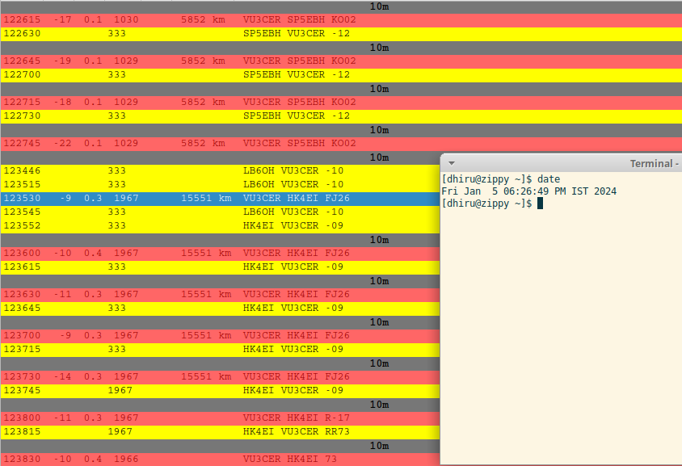
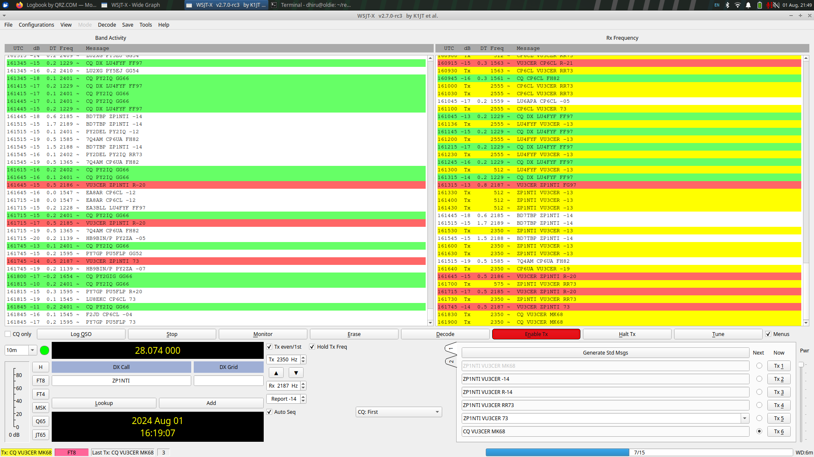
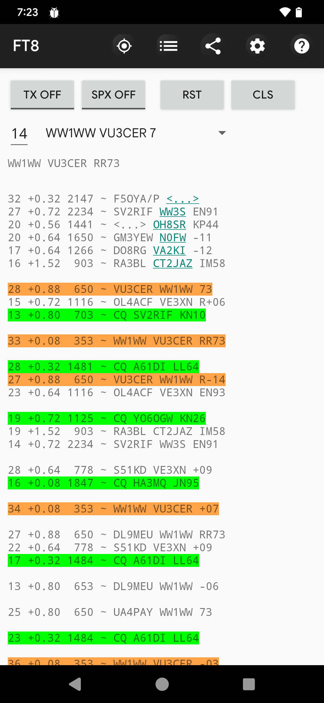
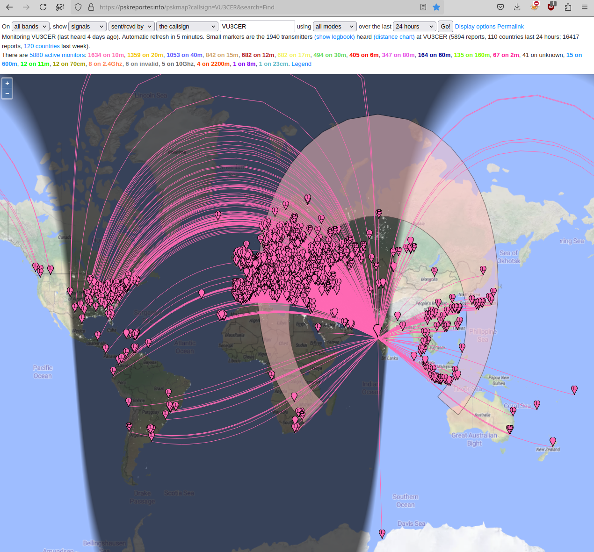
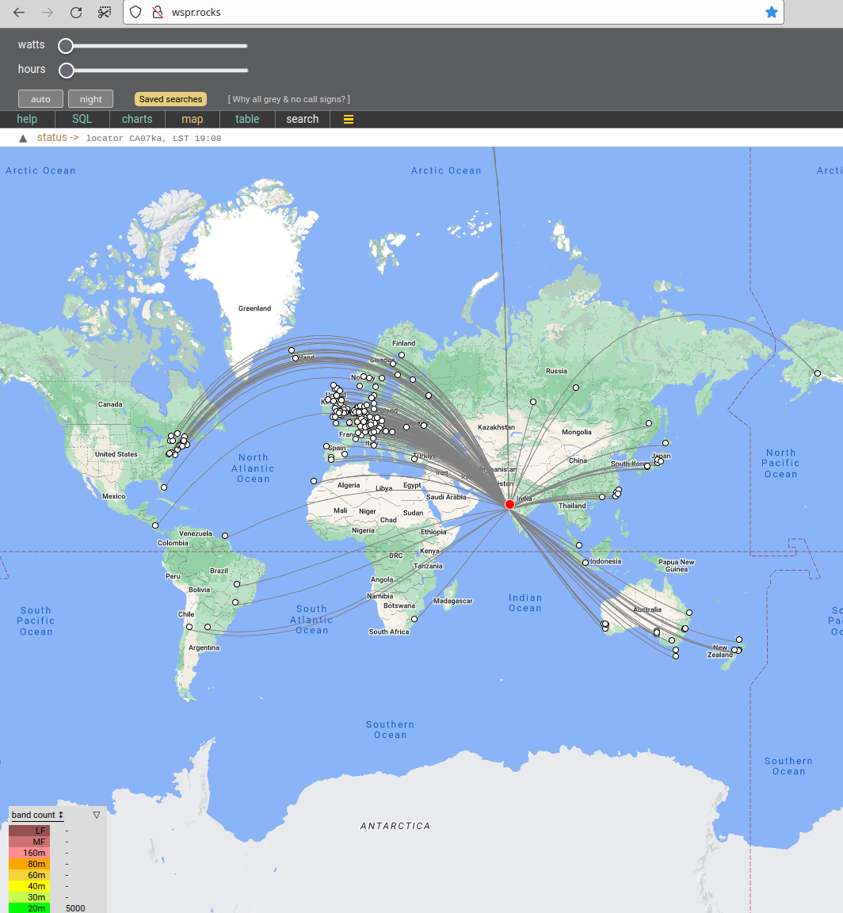
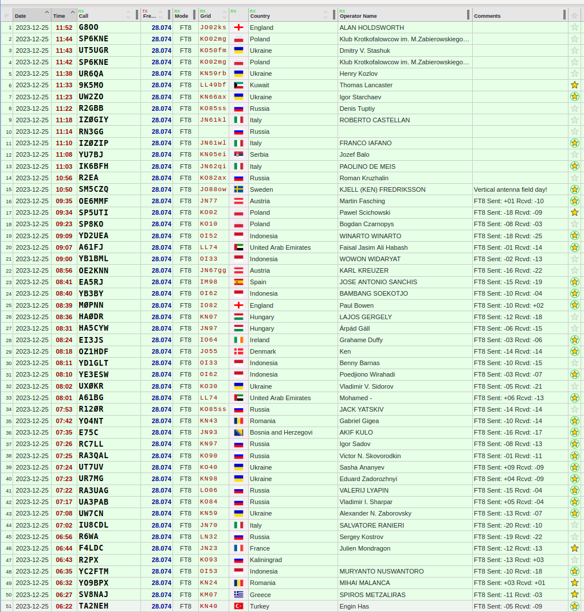
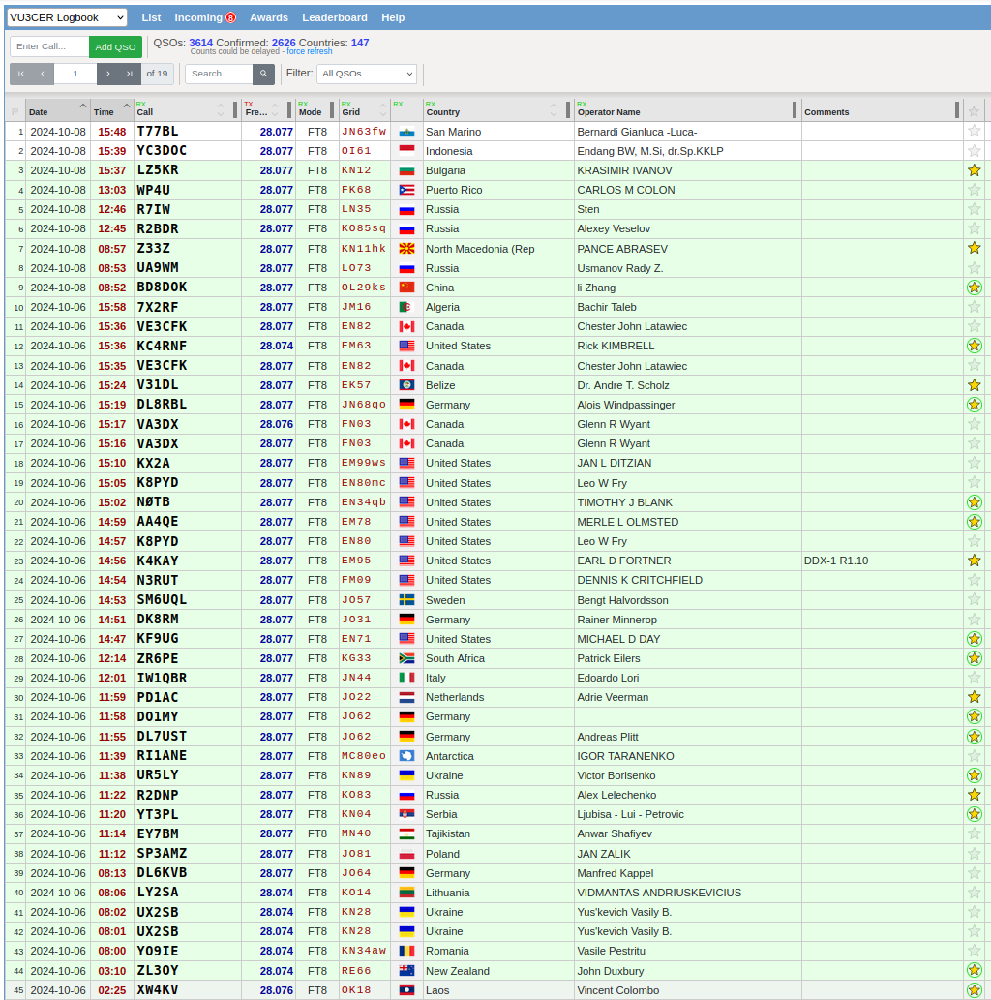

# Intro

For help, please see the [DDX manual](./Manual-for-DDX.md). To purchase an assembled and fully tested DDX-Commercial board please [reach out to us over email](mailto:dhiru.kholia@gmail.com?subject=[DDX]%20Purchasing%20DDX).

The 'Direct Digital Transceiver' (DDX) project. DDX is a radio transceiver
(rig) which is rugged, simple and reliable.

DDX-1 is a 'silent' radio which can be heard almost all over the world!

Current versions:

- DDX-Commercial-3: 5W+ digital transceiver (Commercial, Latest Upgraded Version)

- DDX-1 R1.10: 5W digital transceiver (FOSS)

For a truly portable backpack setup you can combine DDX with the [FT8
Radio](https://play.google.com/store/apps/details?id=com.bunzee.ft8radio)
Android app.

Sample QSO (from Pune to Medellin on 10m, 15691km) on DDX-1:

QSO with Paraguay:

Who doesn't want a QSO from Medellin after binge-watching Narcos? ;)

Another sample QSO with `WW1WW` (Pune to USA):

## Render (DDX Commercial)

5W+ transceiver based on Pico 2 MCU platform. Beats IC-705 in terms of
efficiency and power consumption!

## Features (DDX-1)

- Single USB-C cable for handling both Audio + CAT control

- True 5W output on all HF bands. It even outputs ~1-2 W @ 50 MHz! (We now just
  need a 6m capable receiver section to build a 6m digital transceiver).

- Rock-solid PA which handles open, short, and bad SWR conditions (1:10 SWR
  tested). We knowingly stress-test it with untuned antennas and still manage
  DX (not a recommended practice for sure though).

- Rock-steady VFO which does NOT drift even under exposed conditions.  Yes - it
  receives WSPR at 28 MHz just fine.

- Reliable T/R switching based on a DPDT relay

- Switchable BPF support to get rid of BCI and other interferences (tested
  against OTH radar + 100 kW AM station in close visual proximity)

- No toroids to wind (assuming an external LPF bank is in use) ;-)

- The IRF510 final remains as cool as a cucumber (Class-D operation) - a small
  heat sink is more than enough.

- Avoids problems associated with the 'audio frequency counting' approach used
  by earlier designs. DDX-1 has a bit-perfect, deterministic TX output.

- It works beautifully with the 'FT8 Radio' app
  (https://github.com/kholia/DigitalRadioReceiverSupport/). The 'FT8 Radio' app
  handles FT8 decoding well in real time (Native MCU decoders offer significantly
  reduced performance at the moment). The app can decode 35++ stations at a time,
  and even large screens can fill up very rapidly - such is the receiver's
  performance (with a BPF)!

- DDX-1 comes with a free, open-source AGPLv3 licensed firmware.

- No calibration is (ever) required. Just pick up DDX-1 and it is ready to go
  on air.

- Low cost (cost-effective)

- Stress tested by WSJT-Z for multiple days

- DDX-1 routinely receives FT8 traffic from 80 to 100+ countries using a simple
  5m long EFHW antenna.

## RX Performance

Performance of CD2003-with-BPF is >= 80% of that of RSP1 SDR, at least!

I live right next to a 100 kW AM station (`Pune AIR @ 792 kHz`). Also, there is
an OTH radar nearby operating close to 28 MHz!

## TX Performance

## VFO stability

It receives WSPR @ 28 MHz ;)

## WSPR TX Performance

## QSOs

DDX-1 has already made hundreds of QSOs on air.

## Power sources

DDX-1 was tested with the following power sources.

- SUGON 3005D Adjustable Digital DC Power - RECOMMENDED

- USB battery bank with PD 3.0 and >= 35W output and 15V or 20V PD decoy module
  (RECOMMENDED, safe, portable, durable)

- RUIDENG DPS5020 power supply module (@13v) powered by MEAN WELL / Mornsun SMPS

- 3S "12V" Li-ion 18650 battery pack (can be "volatile")

## Safety Tips

- Use a Common-Mode-Choke (attached between the rig, and the antenna) for
  safety against `return/back RF`.

## Resources

- https://rf-tools.com/lc-filter/

- https://github.com/WB2CBA/ADX (the design that started it all)

- http://www.learningaboutelectronics.com/Articles/Low-pass-filter-calculator.php

- https://github.com/kholia/ConsensusBasedTimeSync (receiver comes from here)

- https://github.com/kholia/Si5351-Module-Clone-TCXO/ (VFO comes from here)

- https://github.com/kholia/HF-PA-v10 (PA comes from here)

  Ruggedness philosophy: https://www.youtube.com/watch?v=4r7wHMg5Yjg

- https://www.kk5jy.net/three-wire-gp/ (recommended antenna - superb for DX)

- https://github.com/kholia/HF-Balcony-Antenna-System (another portable antenna setup)

- https://github.com/batica81/microphone-library-for-pico (Vojislav's work makes DDX-1 possible)

## Joining In

Are you interested in such projects, and spam-free technical discussions?

If yes, you might be interested in joining [the 'HAMBREWERS' Telegram group](https://t.me/+TwzGyKGe8_QI_B3y).
