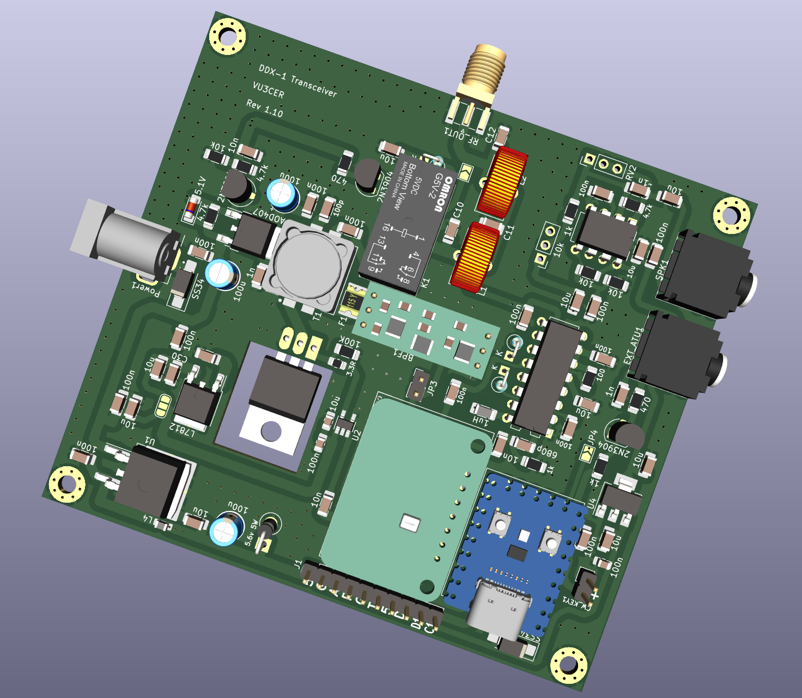
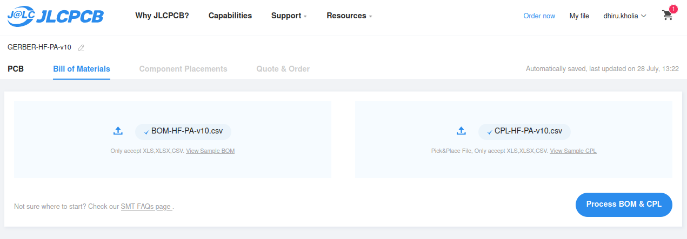
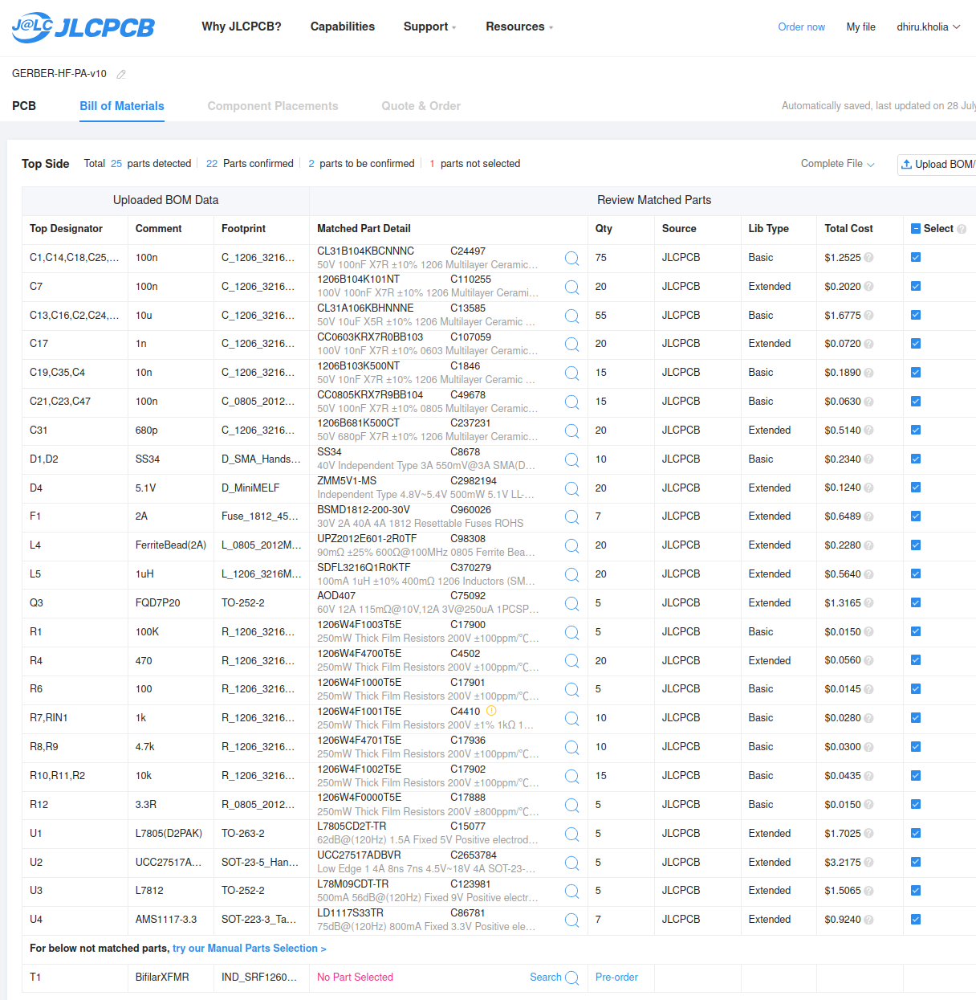
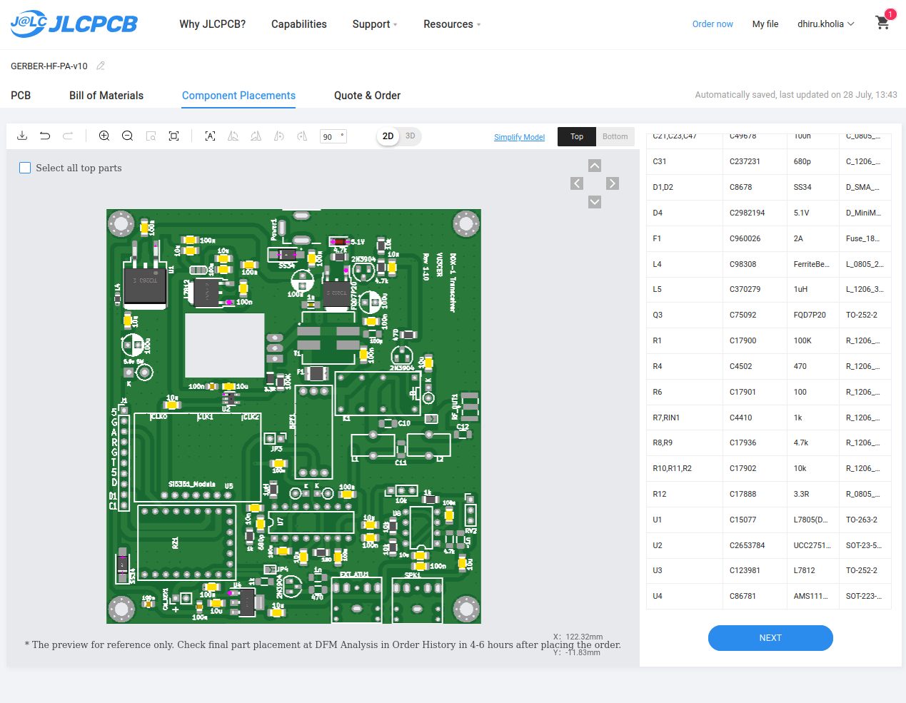
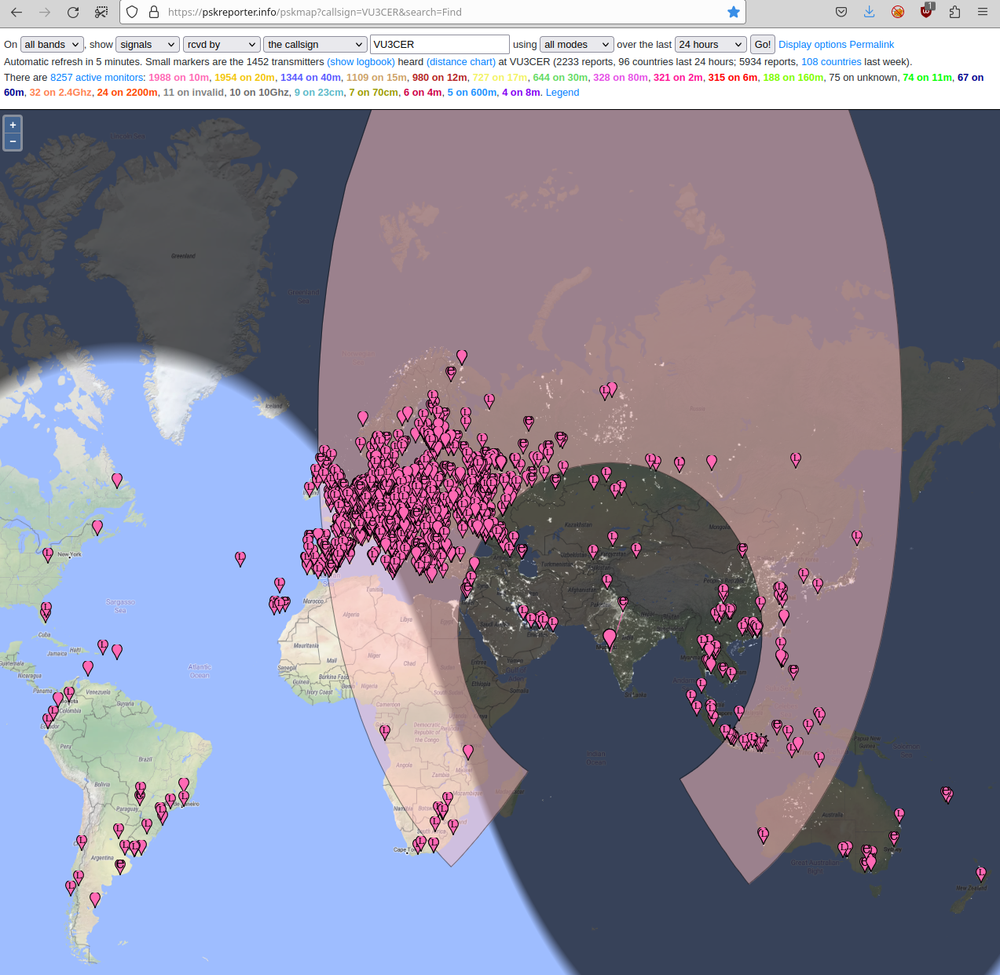
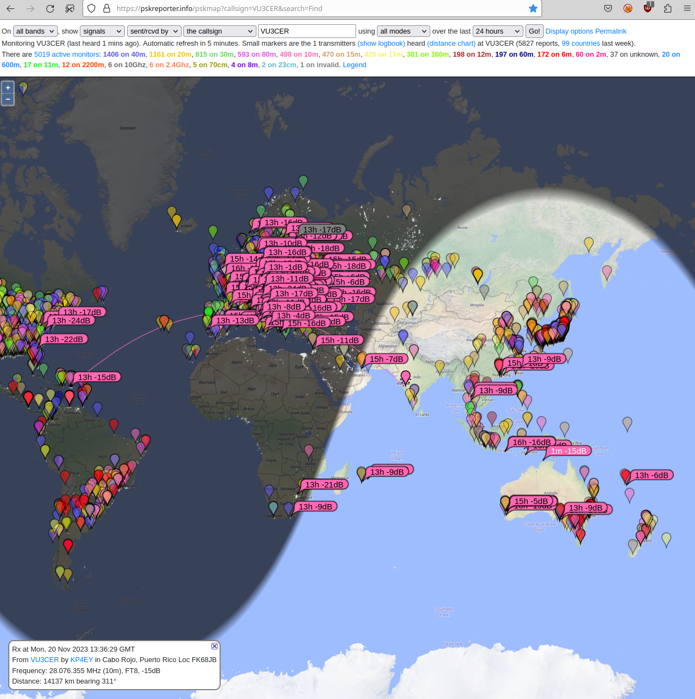
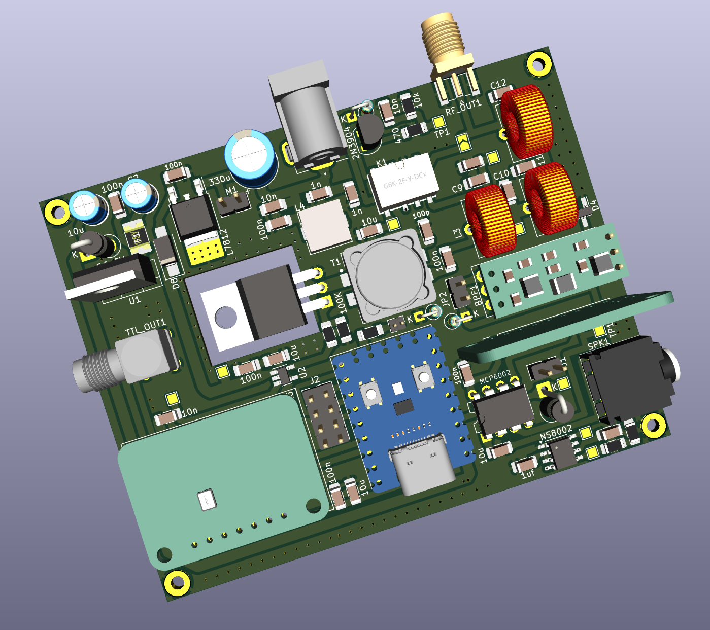
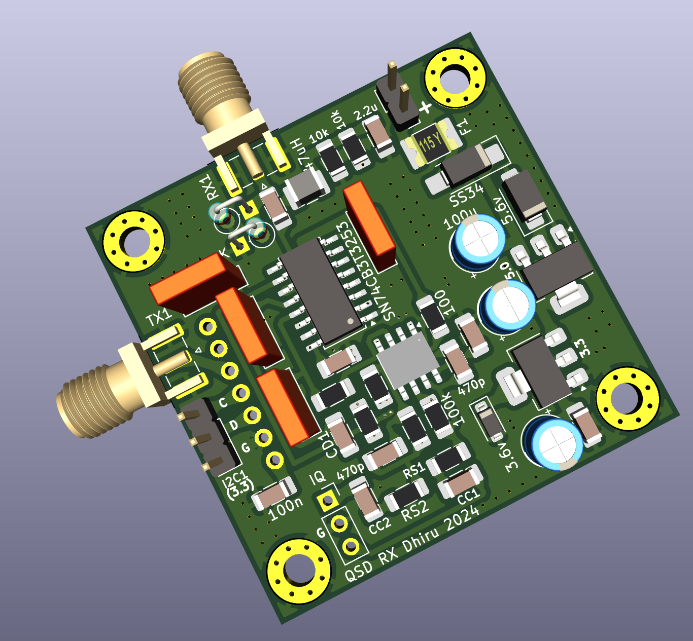
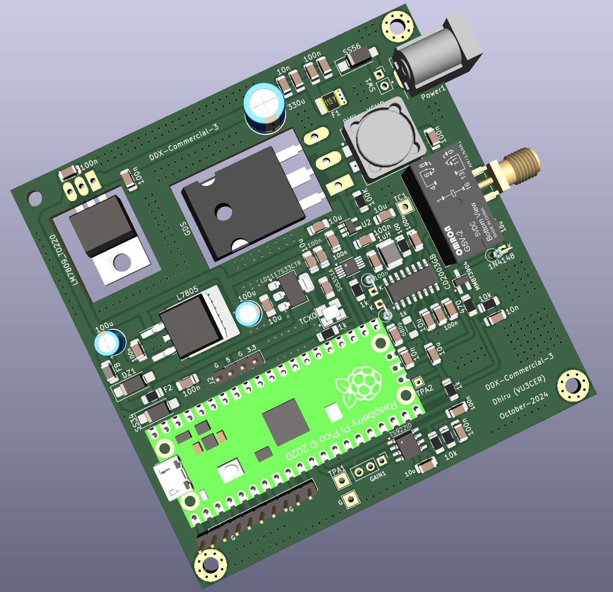

# Intro

The 'Direct Digital Transceiver' (DDX) project. DDX is a radio transceiver
(rig) which is rugged, simple and reliable.

DDX-1 is a 'silent' radio which can be heard almost all over the world!

Complete BOM (everything) estimate: ~1500 INR (15 to 25 USD depending on
the configuration).

Current versions:

- DDX-1 R1.10: 5W digital transceiver (FOSS)

- DDX-Commercial-3: 10W digital transceiver (Commercial)

For a truly portable backpack setup you can combine DDX-1 with the [FT8
Radio](https://play.google.com/store/apps/details?id=com.bunzee.ft8radio)
Android app.


Sample QSO (from Pune to Medellin on 10m, 15691km) on DDX-1:


QSO with Paraguay:


Who doesn't want a QSO from Medellin after binge-watching Narcos? ;)

Another sample QSO with `WW1WW` (Pune to USA):


## Render



## Features (DDX-1)

- Single USB-C cable for handling both Audio + CAT control

- True 5W output on all HF bands. It even outputs ~1-2 W @ 50 MHz! (We now just
  need a 6m capable receiver section to build a 6m digital transceiver).

- Rock-solid PA which handles open, short, and bad SWR conditions (1:10 SWR
  tested). We knowingly stress-test it with untuned antennas and still manage
  DX (not a recommended practice for sure though).

- Rock-steady VFO which does NOT drift even under exposed conditions.  Yes - it
  receives WSPR at 28 MHz just fine.

- Reliable T/R switching based on a DPDT relay

- Switchable BPF support to get rid of BCI and other interferences (tested
  against OTH radar + 100 kW AM station in close visual proximity)

- No toroids to wind (assuming an external LPF bank is in use) ;-)

- The IRF510 final remains as cool as a cucumber (Class-D operation) - a small
  heat sink is more than enough.

- Avoids problems associated with the 'audio frequency counting' approach used
  by earlier designs. DDX-1 has a bit-perfect, deterministic TX output.

- It works beautifully with the 'FT8 Radio' app
  (https://github.com/kholia/DigitalRadioReceiverSupport/). The 'FT8 Radio' app
  handles FT8 decoding well in real time (Native MCU decoders offer significantly
  reduced performance at the moment). The app can decode 35++ stations at a time,
  and even large screens can fill up very rapidly - such is the receiver's
  performance (with a BPF)!

- Supports largely automated assembly from JLCPCB (all the required files are
  in the same GitHub repository)

  
  
  

- DDX-1 comes with a free, open-source AGPLv3 licensed firmware.

- No calibration is (ever) required. Just pick up DDX-1 and it is ready to go
  on air.

- Low cost (20 to 30 USD is our BOM estimate)

- Stress tested by WSJT-Z for multiple days

- DDX-1 routinely receives FT8 traffic from 80 to 100+ countries using a simple
  5m long EFHW antenna.

## License

COMMERCIAL USAGE IS FINE NOW - the design is proven to work well ;)

NO SUPPORT and NO GUARANTEE is provided to individuals! This is because we are
a small team, and we want to make progress with maximum velocity to bring you
more goodies. This said, we are willing to help out with the group builds or
club builds of DDX-1 to maximize our `dV / dT`.

ATTENTION: Using a Si5351 module without a TCXO is a recipe for troubles. You
have been warned ("educated").

Note: The firmware is now under AGPLv3 license.

Note 2: Some folders in this repository are encrypted as they are NOT ready for
public consumption yet. With time and more testing, more stuff will be
released.

## RX Performance



Performance of CD2003-with-BPF is >= 80% of that of RSP1 SDR, at least!

## TX Performance



## VFO stability

It receives WSPR @ 28 MHz ;)


## WSPR TX Performance

This is from a HF-PA-v10 board (@ 2W output setting) driving another HF-PA-v10
board with IRF530 installed on it.


## QSOs

DDX-1 has already made hundreds of QSOs on air.


## Known Gotchas

- DDX-1-R1.10:

  - Building the `Pluggable-RX-BPF` BPF might be the hardest part of this
    project. Well, we are trying to replace a 200 USD Professional-BPF
    (https://surgestop.com/ one) with a ~2 USD BPF after all!

    I recommend getting the BPF boards assembled from JLCPCB, if possible.

    In case you are NOT able to build the BPF, then also no worries. The BPF
    can be bypassed (by a regular jumper cap) for many use cases. Or a QRP Labs'
    BPF can be used along with some twisted jumper wires.

    All this said, our BPF filters are within `~0.3dB` (S21 LOGMAG value) of
    the QRP Labs' BPF filters, and are much quicker to build and test (assuming you
    can solder 0805 SMD components).

    August-2024 update: We are now designing external TX-BPFs which will be
    super easy to build, test, and use - stay tuned!

## Known failure modes

We believe in documenting the various failure modes so that we all can learn
from them, and produce more rugged designs with time and experience.

- After making a few hundred QSOs at home and in local parks, the transmit
  functionality on DDX-1 became wonky. TX would NOT fire at all, or would fire
  for only a few seconds. It will turn on and off and then on and so on.

  This chaotic, random behaviour was indeed tough to debug.

  [July 2024] This was caused by a missing regulator! IRF510 gate voltage needs
  to be less than 11.5v or so! Else, the IRF510 may "oscillate", suddenly
  produce too much power, and then randomly stop producing power, and so on.

  Once we installed U3 (78M09) regulator - which ensures that the IRF510 gate
  only sees 9v - this problem went away in a reliable fashion. If you still
  want to skip installing this regulator, then operating DDX at 10.50v also
  works great!

## Power on sequence (Laptops along with USB-C to USB-A cable)

- Turn on the main power to the PCB.

- Now connect the USB-C cable between DDX and the PC.

- See `wsjtx_helper/README.md` for further steps.

## Power on sequence (Android phone / USB-C to USB-C cable)

- Connect the USB-C cable between DDX and the Android phone.

- Turn on the main DC power to the radio.

- You may have to explicitly enable the `File Transfer` mode in USB settings on
  your Android device.

## Files

With these files, you can get around 80% pre-assembled boards (with the SMD
components soldered) from JLCPCB at a minimal cost.

- [BOM](./DDX-1-R1.10/HF-PA-v10.csv)

- [Gerbers + PCBA files](./DDX-1-R1.10/jlcpcb/production_files)

- [Schematic](./DDX-Schematics-R1.10.pdf)

Note: The Si5351+TCXO boards can be ordered in fully assembled form from
JLCPCB. https://github.com/kholia/Si5351-Module-Clone-TCXO/ has the required
files (use the `-v3` folder).

JLCPCB link: https://jlcpcb.com/

JLCPCB ordering guide: https://github.com/WB2CBA/ADX-UnO-V1.3/ has the JLCPCB
ordering guide in it.

## Build Notes

In case of any doubts / confusion, refer to the latest version of the
`HF-PA-v10.pdf` document. Note: Not everything needs to be populated on the PCB.

## Building the firmware (for Linux users)

Shortcut: Upload the pre-built `.uf2` file to the RP2040 Board and skip
to the next section.

Install dependencies:

```
sudo apt install cmake gcc-arm-none-eabi libnewlib-arm-none-eabi \
  libstdc++-arm-none-eabi-newlib git libusb-1.0-0-dev build-essential \
  make g++ gcc
```

```
mkdir ~/repos
cd ~/repos
```

```
git clone --recursive https://github.com/kholia/tinyusb.git  # use this in pico-sdk
git clone --recursive https://github.com/raspberrypi/pico-sdk.git
git clone --recursive https://github.com/kholia/DDX.git
```

Now build the firmware using instructions in the `firmware_open` folder.

Load the built `.uf2` file into the MCU board. Process: Hold the BOOT button on
RP2040-Zero, and then connect it to a computer. Release the BOOT button. A new
drive will open on the computer. Just drag the .uf2 firmware file (included in
the repository) to this new drive. Done!

## Power sources

DDX-1 was tested with the following power sources.

- SUGON 3005D Adjustable Digital DC Power - RECOMMENDED

- USB battery bank with PD 3.0 and >= 35W output and 15V or 20V PD decoy module
  (RECOMMENDED, safe, portable, durable)

- RUIDENG DPS5020 power supply module (@13v) powered by MEAN WELL / Mornsun SMPS

- 3S "12V" Li-ion 18650 battery pack (can be "volatile")

## Safety Tips

- Use a Common-Mode-Choke (attached between the rig, and the antenna) for
  safety against `return/back RF`.

## Resources

- https://rf-tools.com/lc-filter/

- https://github.com/WB2CBA/ADX (the design that started it all)

- http://www.learningaboutelectronics.com/Articles/Low-pass-filter-calculator.php

- https://github.com/kholia/ConsensusBasedTimeSync (receiver comes from here)

- https://github.com/kholia/Si5351-Module-Clone-TCXO/ (VFO comes from here)

- https://github.com/kholia/HF-PA-v10 (PA comes from here)

  Ruggedness philosophy: https://www.youtube.com/watch?v=4r7wHMg5Yjg

- https://www.kk5jy.net/three-wire-gp/ (recommended antenna - superb for DX)

- https://github.com/kholia/HF-Balcony-Antenna-System (another portable antenna setup)

- https://github.com/batica81/microphone-library-for-pico (Vojislav's work makes DDX-1 possible)

## Joining In

Are you interested in such projects, and spam-free technical discussions?

If yes, you might be interested in joining [the 'HAMBREWERS' Telegram group](https://t.me/+TwzGyKGe8_QI_B3y).

## Notes on `DDX-EVO-*`

DDX-EVO-1 has the following additional features.

- SSB receiver with DSP!

- Software volume control

- AGC!

- Smaller PCB size (90x70)

- Even more simpler design - less things to go wrong



Known limitations of `DDX-EVO-1`: Si4732 is NOT the best for receiving WSPR. It
drifts a lot even with a TCXO clock input. Given this limitation, `DDX-EVO-*`
series is on hold for now.

## The future of DDX

https://github.com/kholia/PicoRX/tree/master/PCB/Easy-uSDX-v4



Is QSD RX the future? Time will tell... stay tuned my friends!

## DDX-Commercial-*



10W+ transceiver based on Pico 2 MCU platform. Beats IC-705 in terms of
efficiency and power consumption!
