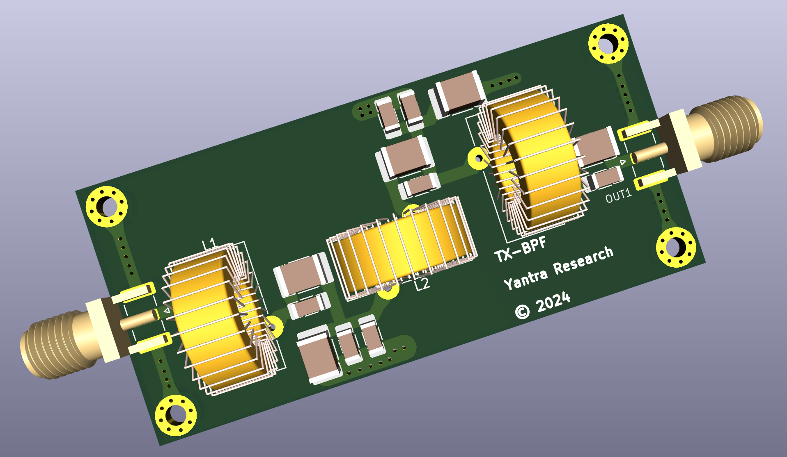
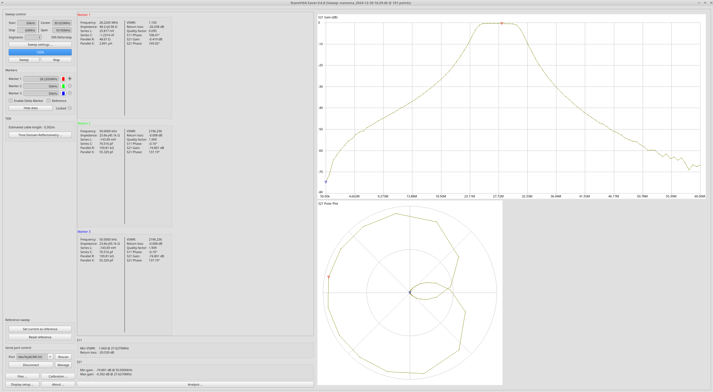

Use https://tonnesoftware.com/elsie.html to open the .LCT files. The free version of Elise is sufficient.

From failure to success reasons:

- Amazing guidance and confidence booster from VU2SPF at LARC 2024 conference

- Being able to measure things properly using my new DE-5000 LCR meter

- Choosing the right program (Elsie) and playing around with it

- Creating a feasible design

  Our previous (failed) BPF design used a 27nH inductor - enough said ;)

- Seeing how inductance and capacitor values affect the response shape

- Elsie works much better (produces realistic filters) than Qucs Studio and
  https://markimicrowave.com/technical-resources/tools/lc-filter-design-tool/
  tools.

  While we are not fans of proprietary software, we are forced to recommend
  Elsie - it is that good!
