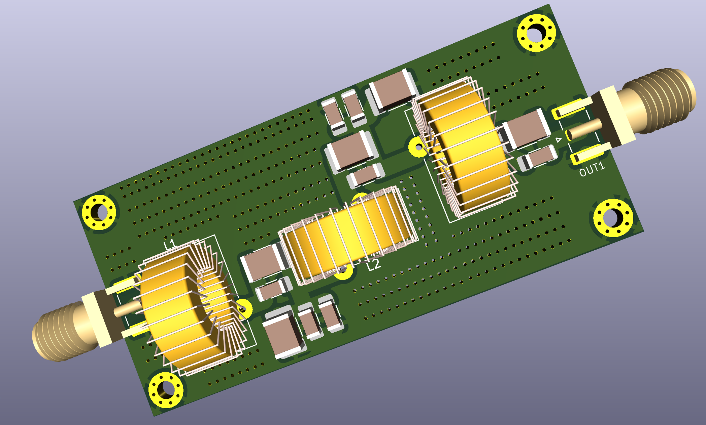

Use https://tonnesoftware.com/elsie.html to open the .LCT files. The free version of Elise is sufficient.

From failure to success reasons:

- Amazing guidance and confidence booster from VU2SPF at LARC 2024 conference

- Being able to measure things properly using my new DE-5000 LCR meter

- Choosing the right program (Elsie) and playing around with it

- Seeing how inductance and capacitor values affect the response shape
